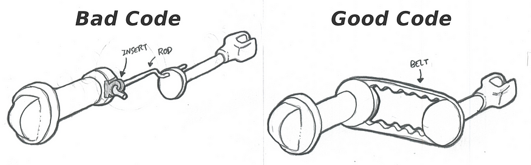

> 本文由 [简悦 SimpRead](http://ksria.com/simpread/) 转码， 原文地址 [www.v2ex.com](https://www.v2ex.com/t/939895#reply2)

本文翻译自国外论坛 medium ，原文地址： [https://medium.com/@todbotts.triangles/what-is-good-bad-code-an-illustrated-example-for-non-programmers-1222b600a0f0](https://medium.com/@todbotts.triangles/what-is-good-bad-code-an-illustrated-example-for-non-programmers-1222b600a0f0)

* * *

我曾经在某个地方读到过一句话，基本上有以下内容：

> 在现代世界中，许多人的生活依赖于软件，例如控制大型商用客机飞行系统的软件，但软件开发领域大多不受监管。任何人都可以成为自学成才的软件开发人员，而且没有像其他高风险职业那样的认证或严格要求，比如摩天大楼建筑或神经外科。这是一个危险的不受监管的领域，因为根据情况，几行坏代码实际上可能会导致生命损失。

那么作为外行，什么是 “坏代码”？
=================

作为一个每天大约 5 个小时编写、审查和重构代码（意思是，以更简洁和可用的方式重新编写）的人，我知道什么是代码（以及什么是坏代码，相信我！）。有时我忽略了一个事实，即许多人对代码是什么，没有概念。

对于那些人，我对 “你是程序员，你是做什么的？” 这个问题给出了以下答案，打个比方：

> 我开发了一个非常细微小门的电子开关组件，以不同的方式和不同的配置打开和关闭门。当门打开时，电可以通过，当门关闭时，电被阻挡。由于门太小，不能手工建造，我不得不让人用电脑建造它们。根据我在电脑上输入的单词，它会代表我建造各种类型的这些小门。

毫无疑问，正如上面的回答所述，软件开发人员 / 程序员实际上是在构建具有物理存在但太小而看不见的东西（然而，可以将其想象为集合或一组小门）。这本身就够疯狂的了，但是如果您至少可以想象一下这些场景（比如列车控制程序、飞机飞行时的导航程序），那么您已经对什么是 “编码” 有了一个概念性的理解，祝贺您！那么回到这一节标题中的问题 — 什么是 “坏代码”？

按照我们对小门的微小组合的比喻，我会说坏代码意味着你有太多的门，以不必要的重复或复杂的方式排列。

由于很难用门做比喻来进一步形象化或解释，在这一点上我想提供另一个比喻，如下所示。

打造一个旋钮调节器！
==========

假设我们想要构建一个旋钮调节器。一个可以旋转的旋钮，它会依次旋转远程位置的另一个旋钮。产品要求如下图。转动一个旋钮，远处的另一个旋钮也会转动： 

坏代码只考虑手头的问题，并提出最简单的解决方案，一个旋钮和一个旋钮调节器，由半柔性杆连接。在这个早期阶段，坏代码赢得了奥卡姆剃刀奖（开发速度非常快）。好的代码起初似乎有点矫枉过正，使用了橡胶带和 2 个轮子（开发速度较慢）。 

需求变更，旋钮位置变了！
============

就像在开发周期中经常发生的那样，在某个时刻，客户需求会发生变化。在我们这里的比喻中，客户现在想要一个旋钮旋钮，可以旋转位于原始旋钮侧面的另一个旋钮，如下所示： 

坏代码需要添加一些偷工减料的组件，使整个系统更加摇摇欲坠并且容易出现故障。好的代码只需要在新需求进来时稍微调整一下，简单地使用更长的橡胶带就可以解决这个问题。 

要求更改，旋钮需要转得慢一些！
===============

最后，我们的客户决定他们希望旋钮以不同的速度旋转。输入旋钮的小旋转应该会导致连接的旋钮大旋转。

鉴于这一新要求，不良代码需要向系统添加更多组件，从而使其更加复杂。另一方面，好的代码同样只需要稍微调整，在连接的旋钮侧使用更大的轮子： 

总结
==

如上所述，当需求很简单时，好的代码通常看起来有点过头，但当客户需求发生变化时，好的代码就会真正发光发热。换句话说，它能适应未来的规模和变化。另一方面，对于简单的问题来说，坏代码看起来很简单，很棒，但当系统发生变化或复杂性增加时，它就会变成噩梦。

但也许你在想，“好吧，上面概述的两个系统都达到了相同的结果——旋钮调节器在任何一种情况下都能成功工作。”

然而，从本质上讲，专业编码是一种协作努力，无论您编写什么代码，无论是现在还是将来，其他程序员都需要不断地阅读和接手这些代码。如果代码能尽可能容易被理解，这些程序员的工作将会更容易和更有效率。

那么假如说你是初级开发人员，从其他开发人员那里接管代码库，您更愿意听到下面哪个消息？

1.  “这是我们的旋钮调节器，它由 2 个轮子和一条皮带组成”，或者
2.  “这是固定连杆的插件，这是连杆，你必须将它的末端插入另一个插件的小孔中……”

本文翻译自国外论坛 medium ，原文地址： [https://medium.com/@todbotts.triangles/what-is-good-bad-code-an-illustrated-example-for-non-programmers-1222b600a0f0](https://medium.com/@todbotts.triangles/what-is-good-bad-code-an-illustrated-example-for-non-programmers-1222b600a0f0)

* * *
