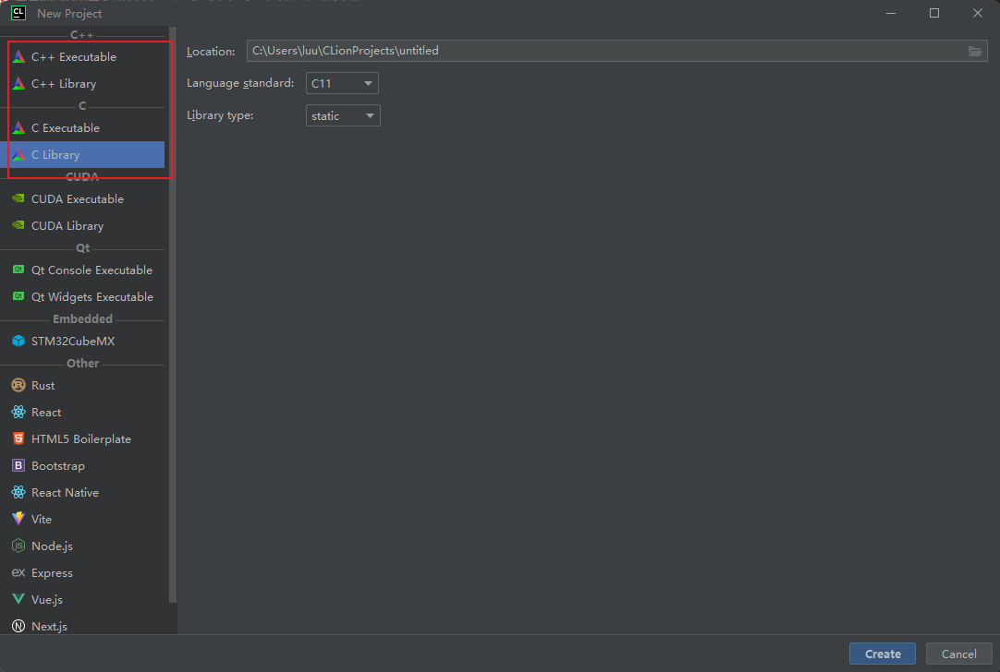
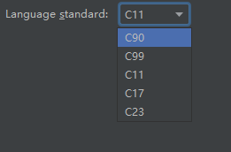

因为如果想写一些"数据结构的话",最好是能用到C语言之类的底层语言,然后我想使用CLion这个软件.

一打开直接蒙蔽了,开始问chatgpt
## C++ Executable ,C++ library ,C Executable ,C library的区别

在CLion中创建项目时，您可以选择四种不同类型的项目：C++可执行文件，C++库，C可执行文件和C库。现在我们来解释一下它们之间的区别：

**C++可执行文件**

如果你想写一个C++程序来完成某个任务，这个项目就适合你。可执行文件是你运行的程序，它包含了所有必要的代码，并可以直接被操作系统执行。当你构建这种类型的项目时，你会得到一个名为`projectname.exe`的可执行文件。

**C++库**

库项目是用于构建共享或静态库的项目。库是一组代码, 可以供其他程序调用和重用。您可以创建一个动态链接的共享库或一个静态库，然后在使用它的其他项目中链接它。当你构建这种类型的项目时，你会得到一个库文件，它可以被其他项目共享使用。

**C可执行文件**

和C++可执行文件相似，这个项目类型是用于编写C程序的。当您使用C语言编写代码时，应该选择这个项目类型。当你构建这种类型的项目时，你会得到一个名为`projectname.exe`的可执行文件，它可以被操作系统直接执行。

**C库**

这个项目类型用于构建C语言库。您可以将C语言代码打包成一个库以供其他程序使用。当你构建这种类型的项目时，你会得到一个库文件，它可以被其他项目共享使用。

如果您不确定该使用哪种项目类型，您可以根据您想要完成的具体任务来选择。如果您要编写自己的程序，应该选择可执行文件。如果您想重用代码，并将它们打包成可供其他程序使用的库，那么应该选择库项目。同样，如果您编写的是C语言，应该将项目类型设置为C。

如果选择C Executable还需要在看一下 Language standard的选择

## C11 C90 C99 C17 和 C23 的区别
当您在CLion中创建新的C项目时，您可以选择使用不同的C语言标准，包括C90，C99，C11，C17和C23。在这里，我将为您提供每个标准的详细概述：

**C90** C90，也称为ANSI C，是最早的C语言标准，于1990年发布。它涵盖了C语言的基本特性，包括循环结构、数据类型、指针等，同时引入了一些重要的关键字和库函数。C90具有良好的向后兼容性，这意味着大多数基于C90的代码都可以在更高版本的C语言标准中编译和运行。

**C99** C99标准于1999年发布，是C语言的一个重要更新。C99引入了新特性，包括布尔类型、可变长度数组、内联函数、复合文字和注释等。C99还增加了对标准数学库的支持，并增加了一些新的函数。C99语言标准对于编写现代化的C代码非常有用。

**C11** C11标准于2011年发布，是C语言的下一个主要更新。C11引入了一些新的特性，包括多线程支持、_Generic关键字和Unicode支持。C11还对一些现有的特性进行了修改和更新，使其更容易使用。C11的主要目标是提高C语言的可移植性和可靠性。

**C17** C17标准于2018年发布，是C语言的最新标准。C17对C11进行了一些修改，包括在函数之外初始化静态变量、增加`noreturn`函数属性和增加字符类型支持方言等。C17通过一些小的更新，进一步改善了C语言并使其更易于使用。

**C23** C23是现在正在制定中的C语言标准。该标准将在C11和C17的基础上进行修改和改进，并引入新特性，如`vinline`函数属性、更好的垃圾回收支持等。C23标准可以使C语言更适合现代软件开发需求。

在选择一个特定的C语言标准时，应该考虑您要编写的具体代码和使用的库和工具，并选择最适合该代码和工具的标准。选取一个现代的标准如C11或C17可以确保代码的可移植性和功能性。